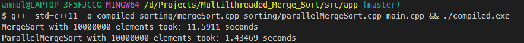
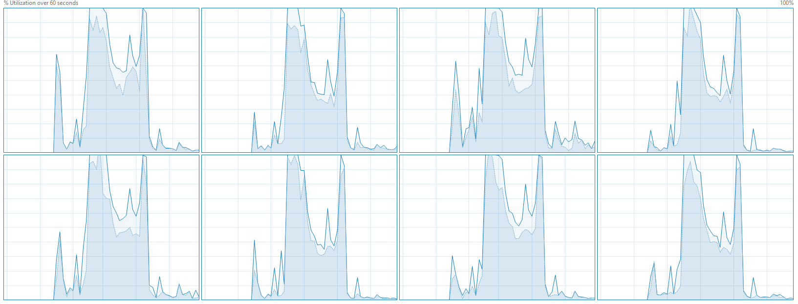

### Script to run the code:  `$ g++ -std=c++11 -o compiled sorting/mergeSort.cpp sorting/parallelMergeSort.cpp main.cpp && ./compiled.exe`

## 1st running, just MergeSort

## Final Stats, Comparison 

## CPU Cores

